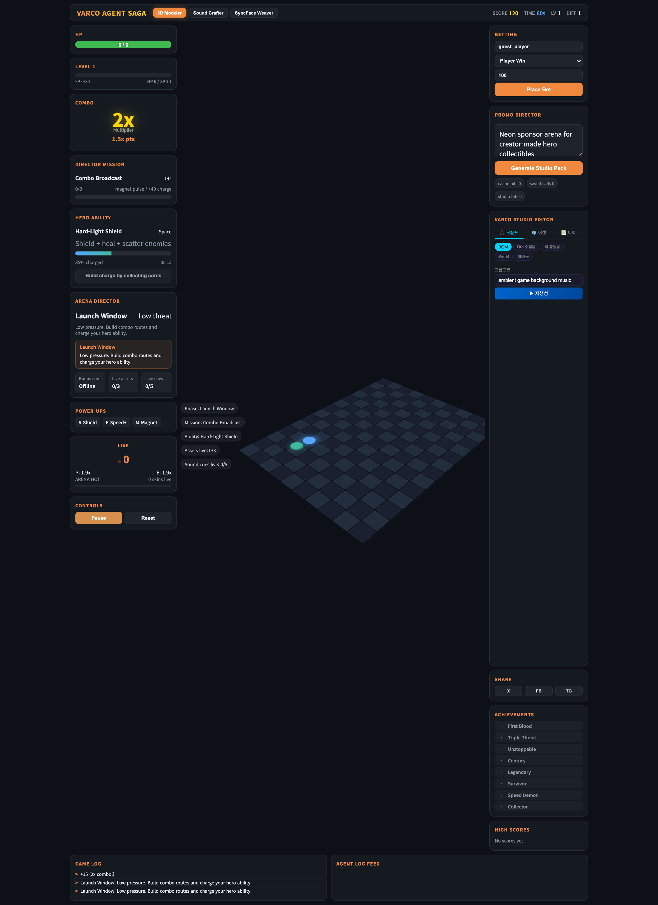
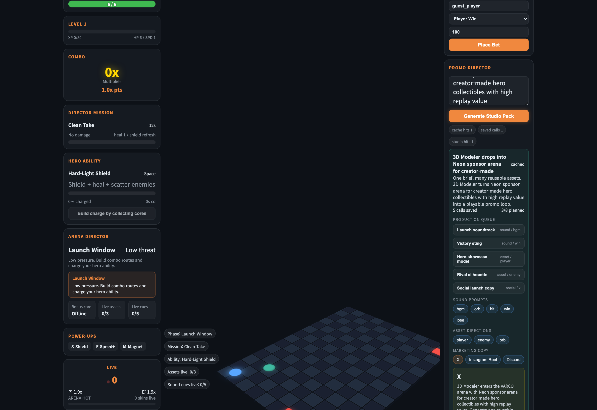

# VARCO Agent SAGA

[](https://github.com/akillness/varco_ads_game)
[](./package.json)
[](./e2e/browser-test.spec.js)
[](https://akillness.github.io/varco_ads_game/)

VARCO Agent SAGA는 `짧은 플레이 세션`, `프로모션 카피`, `VARCO 생성 파이프라인`을 한 루프로 묶은 아케이드형 홍보 게임입니다.  
플레이어는 스폰서가 개입하는 전장을 돌파하면서 점수와 미션을 관리하고, 스튜디오 패널에서는 같은 캠페인 브리프를 사운드, 3D 에셋, 마케팅 카피로 재사용할 수 있습니다.

> GitHub Pages 대상 URL은 `https://akillness.github.io/varco_ads_game/` 이지만, 2026-03-20 기준 현재 공개 배포는 확인되지 않았습니다.

## Screenshots

### Gameplay + Director HUD



### Studio Pack Workflow



## What This Project Does

- 순간 판단이 필요한 아케이드 플레이:
  미션, 능력 충전, 디렉터 페이즈, 보너스 코어, 적 압박이 동시에 돌아갑니다.
- 한 브리프로 여러 산출물을 재사용:
  같은 캠페인 텍스트에서 BGM, SFX, 3D 에셋 방향, 마케팅 카피를 같이 생성합니다.
- VARCO 호출 비용 절감:
  서버 캐시와 프롬프트 재사용으로 반복 호출을 줄이고 cache hit을 UI에서 바로 확인할 수 있습니다.
- 실서비스 키 없이도 데모 가능:
  `VARCO_OPENAPI_KEY`가 없어도 mock-safe 흐름으로 게임성과 편집 플로우를 검증할 수 있습니다.

## Core Loop

1. 플레이어가 런을 시작해 오브와 미션을 수집합니다.
2. Director 시스템이 Sponsor Drop, Focus Window, Drone Surge 같은 페이즈 이벤트를 발생시킵니다.
3. Studio Pack이 하나의 브리프를 사운드/에셋/홍보 카피로 변환합니다.
4. 생성 결과는 편집 히스토리와 캐시 지표에 누적되어 다음 프로모션 작업의 비용을 줄입니다.

## Stack

- `web/`: Vite + React 기반 게임 UI 및 에디터
- `server/`: Express 기반 VARCO proxy, studio-pack, cache API
- `e2e/`: Playwright E2E 시나리오
- `docs/`: 게임 기획, VARCO 활용 전략, 오케스트레이션 기록

## Quick Start

```bash
git clone https://github.com/akillness/varco_ads_game.git
cd varco_ads_game
npm run install:all
npm run dev
```

로컬 기본 주소:

- Web: `http://localhost:5173`
- Server: `http://localhost:8787`
- Health: `http://localhost:8787/api/health`

## Build And Test

```bash
npm run build
npm test
```

테스트 범위:

- API health/cache contract
- studio-pack cache reuse
- gameplay HUD, director panel, studio KPI strip
- sound/asset editor apply flow
- debug bridge 기반 deterministic reset

## VARCO Integration

실제 VARCO 호출을 쓰려면 `server/.env.example`를 기준으로 환경 변수를 채우면 됩니다.

주요 변수:

- `VARCO_OPENAPI_KEY`
- `VARCO_API_BASE`
- `VARCO_TEXT2SOUND_PATH`
- `VARCO_IMAGE_TO_3D_PATH`

키가 없어도 mock mode로 UI, gameplay, studio-pack 흐름은 유지됩니다.

## Docker

```bash
npm run docker:up
```

중지:

```bash
npm run docker:down
```

## Repository Guide

- [docs/00_project-overview.md](./docs/00_project-overview.md)
- [docs/03_varco-api-usage.md](./docs/03_varco-api-usage.md)
- [docs/04_game-design-document.md](./docs/04_game-design-document.md)
- [docs/05_bmad-gds-delivery.md](./docs/05_bmad-gds-delivery.md)

## Current Positioning

이 프로젝트는 단순 광고 랜딩 페이지가 아니라, 아래를 동시에 증명하는 데 초점을 둡니다.

- 게임성이 있는 인터랙션이 브랜드 메시지 체류 시간을 늘릴 수 있는가
- 생성형 에셋 파이프라인이 마케팅 제작 비용을 실제로 줄일 수 있는가
- 하나의 브리프를 여러 미디어 산출물로 재사용하는 운영 경험이 가능한가
